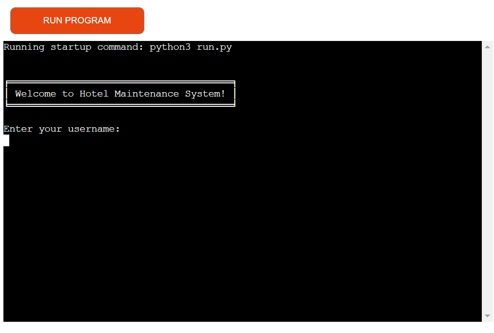

# HMS - Hotel Maintenance System
(Developer: Karol Mileszko)

[View live site](https://hms.herokuapp.com/)

1. [Project Goals](#project-goals)
    1. [User Goals](#user-goals)
    2. [Site Owner Goals](#site-owner-goals)
2. [User Experience](#user-experience)
    1. [Target Audience](#target-audience)
    2. [User Stories](#user-stories)
    3. [Scope](#scope)
    4. [User Manual](#user-manual)
3. [Technical Design](#technical-design)
    1. [Flowchart](#flowchart)
    2. [Data Models](#data-models)   
4. [Technologies Used](#technologies-used)
    1. [Languages](#languages)
    2. [Frameworks and Tools](#frameworks-and-tools)
5. [Features](#features)
6. [Testing](#validation)
    1. [Python Validation](#Python-validation)
    2. [Testing user stories](#testing-user-stories)
8. [Bugs](#Bugs)
10. [Deployment](#deployment)
11. [Credits](#credits)
12. [Acknowledgements](#acknowledgements)

## Project Goals 

- Hotel Management System is created with the intention to become the real world application for hospitality businesses with special focus on hotels. 
- HMS enables users to submit issues occured around the property, like damaged appliances or anything that might need repair, helping the Maintenance Team in keeping track of work that has to be done to keep property in appropriate state. 
- HMS also lets users check on state of rooms or any other areas of the business. 

### User Goals
Primary users of the system are employees at the front desk, especially Receptionists, and members of the Maintenance Team. 
- Submit issues around the property (predominantly Receptionists).
- Check on issues related to specific rooms or other areas in the hotel (Receptionists and members of the Maintenance Team). 
- See list of rooms with reported issues (predominantly members of the Maintenance Team). 