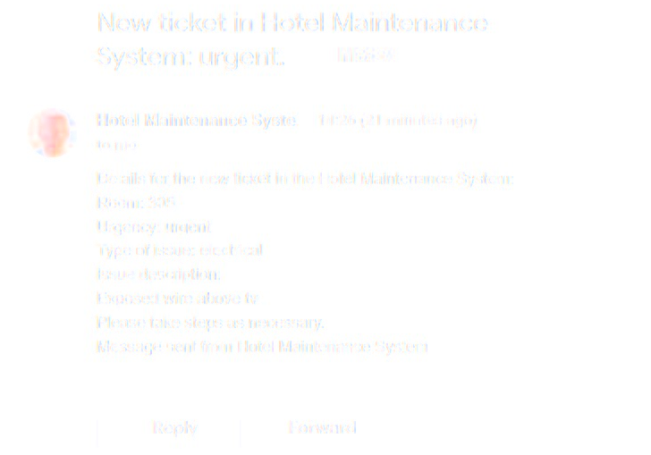

# HMS - Hotel Maintenance System
(Developer: Karol Mileszko)

[View live site](https://hms.herokuapp.com/)

1. [Project Goals](#project-goals)
    1. [User Goals](#user-goals)
    2. [Site Owner Goals](#site-owner-goals)
2. [User Experience](#user-experience)
    1. [Target Audience](#target-audience)
    2. [User Stories](#user-stories)
    3. [Scope](#scope)
    4. [User Manual](#user-manual)
3. [Technical Design](#technical-design)
    1. [Flowchart](#flowchart)
    2. [Data Models](#data-models)   
4. [Technologies Used](#technologies-used)
    1. [Languages](#languages)
    2. [Frameworks and Tools](#frameworks-and-tools)
5. [Features](#features)
6. [Testing](#validation)
    1. [Python Validation](#Python-validation)
    2. [Testing user stories](#testing-user-stories)
8. [Bugs](#Bugs)
10. [Deployment](#deployment)
11. [Credits](#credits)
12. [Acknowledgements](#acknowledgements)

## Project Goals 

- Hotel Management System is created with the intention to become the real world application for hospitality businesses with special focus on hotels. 
- HMS enables users to submit issues occured around the property, like damaged appliances or anything that might need repair, helping the Maintenance Team in keeping track of work that has to be done to keep property in appropriate state. 
- HMS also lets users check on state of rooms or any other areas of the business. 

### User Goals

- Submit issues around the property (predominantly Receptionists).
- Check on issues related to specific rooms or other areas in the hotel (Receptionists and members of the Maintenance Team). 
- See list of rooms with reported issues (predominantly members of the Maintenance Team). 

## User Experience

### Target Audience
- Employees at a hotel front desk, especially Receptionists, 
- Members of the Maintenance Team.

### User Stories

#### Regular User
1. As a user I want to check if there are issues related to a specific room in the hotel (Receptionist, member of the Maintenance Team).
2. As a user I want to report an issue with a specific room or other area of the establishment (Receptionist, Lower-level Manager). 
3. As a user I want to see a list of all reported issues (member of the Maintenance Team)
4. As a user i want to see details of any reported issue (member of the Maintenance Team)
5. As a user I want to be notified about new issues (Leader of the Maintenance Team)
6. As a user I want clear information about urgency of any reported issue to help me in prioritization of work given to members of my team (Leader of the Maintenance Team).
7. As a user I want clear information about nature of any reported issue to help me in deciding on delegating tasks to members of my team and outsorcing work to other supliers (Leader of the Maintenance Team).

#### Site Owner
8. As a site owner I want a smooth flow of information between members of the Front Desk and Maintenance Team for fast response and effective execution of repair works.
9. As a site owner I want Front Desk staff to be able to enter information on current issues around mainaining the hospitality area. 
10. As a site owner I want the Maintenance Team to have fast and accurate information on current issues around the property.
11. As a site owner I want only authorized staff to have access to the system.

### Scope

In first release the scope is to deliver mechanisms to:
- Report new issues. 
- Enquire about specific rooms. 
- See all maintenance tickets with a brief summary.
- Notify Leader of the Maintenance Team about new issues by email.
- Store tickets in a Google Worksheet.
- Grant access only to user with correct login credentials.

In future releases further expansion of functionality would be considered:
- Various levels of user access.
- Expanded manipulation of tickets depending on user credentials.
- Enhanced search mechanisms, e.g. by priority or kind of issue. 
- Enhanced reporting mechanisms.

### User Manual

    
Click Here for User Manual

## Technical Design

### Flow Chart

Flow chart for this application, placed below, has been produced with [Lucid](https://lucid.app/) service. 

Flowchart

### Data models

For this project the following were used:
- Functions - most functions are used to manipulate data related to maintenance tickets. Within functions several techniques were used for handling data, among others:
    - Try Except statements to validate data entered by user. This proved usefull for maintaining consistency of data within tickets and for checking user login credentials.
    - Some functions are designed as sequencies of other functions. This approach helped me optimally group and manipulate order of functions in responce to choices made by user while using the system.
    - Import modules were used for additional functionality: pwinput for masking password with asterisks, tabulate for printing ticket data on screen in a form of a table for better readability compared to printing bare lists or lists of lists, Counter for indexing functionality.
- List and dictionaries - lists were used for ticket data and user credentials; dictionaries were used mainly for simplification of choices made by user, e.g. "u for urgent". 
- Google Sheets API - for secure storing data outside of the time the application is run.  
- Zapier automation - for enhanced communication: on new entry in the Google worksheet containing ticket data (i.e. when a new maintenance ticket is entered by user) the Maintenance Team Leader is notified by email. An example of such email can be found below.

Email notification

