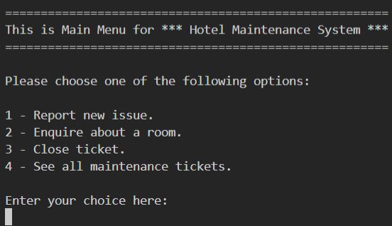
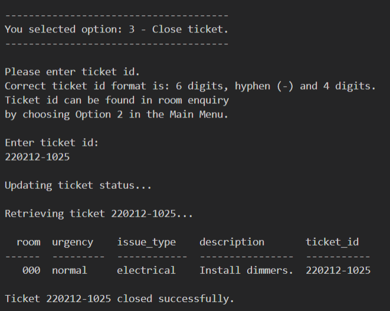
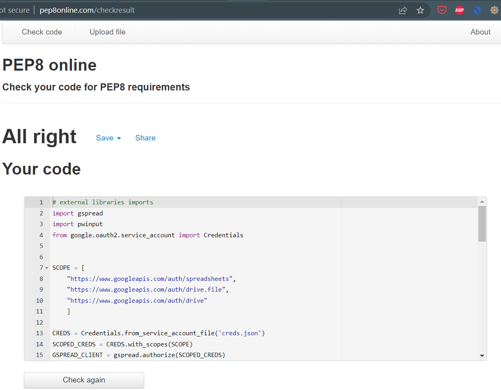
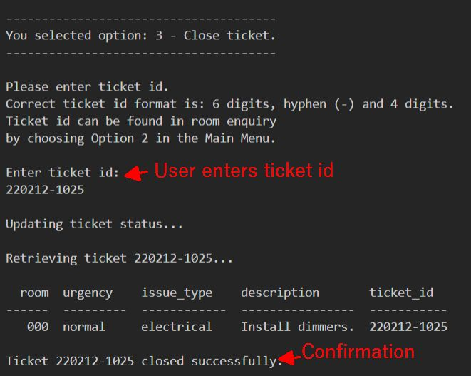

# HMS - Hotel Maintenance System
(Developer: Karol Mileszko)

[View live site](https://hms.herokuapp.com/)

1. [Project Goals](#project-goals)
    1. [User Goals](#user-goals)
    2. [Site Owner Goals](#site-owner-goals)
2. [User Experience](#user-experience)
    1. [Target Audience](#target-audience)
    2. [User Stories](#user-stories)
    3. [Scope](#scope)
    4. [User Manual](#user-manual)
3. [Technical Design](#technical-design)
    1. [Flowchart](#flowchart)
    2. [Data Models](#data-models)   
4. [Technologies Used](#technologies-used)
    1. [Languages](#languages)
    2. [Frameworks and Tools](#frameworks-and-tools)
5. [Features](#features)
6. [Testing](#validation)
    1. [Python Validation](#Python-validation)
    2. [Testing user stories](#testing-user-stories)
8. [Bugs](#Bugs)
10. [Deployment](#deployment)
11. [Credits](#credits)
12. [Acknowledgements](#acknowledgements)

## Project Goals 

- Hotel Management System is created with the intention to become the real world application for hospitality businesses with special focus on hotels. 
- HMS enables users to submit issues around the property, like damaged appliances or anything that might need repair or upgrade, helping the Maintenance Team in keeping track of work that has to be done to keep property in appropriate state. 
- HMS also lets users check on current state of rooms or any other areas of the business. 

### User Goals

- Submit issues around the property (predominantly Receptionists).
- Check on issues related to specific rooms or other areas in the hotel (Receptionists and members of the Maintenance Team). 
- See list of rooms with reported issues (predominantly members of the Maintenance Team). 

## User Experience

### Target Audience
- Employees at a hotel front desk, especially Receptionists, 
- Members of the Maintenance Team.

### User Stories

#### Regular User
1. As a user I want to check if there are issues related to a specific room in the hotel (Receptionist, member of the Maintenance Team).
2. As a user I want to report an issue with a specific room or other area of the establishment (Receptionist, Lower-level Manager). 
3. As a user I want to see a list of all reported issues (member of the Maintenance Team)
4. As a user i want to see details of any reported issue (member of the Maintenance Team)
5. As a user I want to be notified about new issues (Leader of the Maintenance Team)
6. As a user I want clear information about urgency of any reported issue to help me in prioritization of work given to members of my team (Leader of the Maintenance Team).
7. As a user I want clear information about nature of any reported issue to help me in deciding on delegating tasks to members of my team and outsourcing work to other suppliers  (Leader of the Maintenance Team).
8. As a user I want to be able to close tickets containing resolved issues (member of the Maintenance Team, Receptionist).

#### Site Owner
9. As a site owner I want a smooth flow of information between members of the Front Desk and Maintenance Team for fast response and effective execution of repair and upgrade works.
10. As a site owner I want Front Desk staff to be able to enter and access information on current issues around maintaining the hospitality area. 
11. As a site owner I want the Maintenance Team to have fast and accurate information on current issues around the property.
12. As a site owner I want only authorized staff to have access to the system.

### Scope

In first release the scope is to deliver mechanisms to:
- Report new issues. 
- Enquire about specific rooms.
- Change status of a ticket from open to closed.
- See all maintenance tickets with a brief summary.
- Notify Leader of the Maintenance Team about new issues by email.
- Store tickets in a Google Worksheet.
- Grant access only to user with correct login credentials.

In future releases further expansion of functionality would be considered:
- Various levels of user access.
- Expanded manipulation of tickets depending on user credentials.
- Enhanced search mechanisms, e.g. by priority or kind of issue. 
- Enhanced reporting mechanisms.

### User Manual

Click Here for User Manual

---

#### Overview
The Hotel Maintenance System (HMS) is designed for efficient and timely management of issues arrising around a property. It's main focus is the use in hotels, motels, bed & breakfasts, youth hostels and other kinds of establishments in the hospitality business. It enables staff of different departments, most notably the Front Desk / Reception and Maintenance Team, to report, check status and close tickets with break-downs and upgrades around the hotel.

#### Using HMS
It is necessary to follow instructions shown on the screen to be able to proceed with the program. E.g. to choose option 1 an actual digit 1 needs to be entered from the keyboard in the place indicated, not clicking the option or writing words describing the option.
Whenever entry is limited to a number of options (e.g. 1, 2, 3, 4) or need to be keyed in in a specific format (e.g. room number) a clear instruction is provided and the input is validated and accepted only when requirements are met. 

#### Login
Upon starting HMS you need to enter correct login and password. These may be issued by the administrator of the program.

#### Main Menu
After correctly logging in you are presented with the following options:

##### 1 - Report new issue.
Selecting this options will let you submit a new maintenance ticket. This is done by answering four questions about details of the issue: room number (or "000" for other areas), issue urgency, brief description, and nature of the issue (mechanical, electrical etc.). After answering those questions you may submit the ticket or abandon the operation. When a new ticket is submitted, it is immediately available for viewing by other users and email with details of the ticket is sent to the inbox of a member of the Maintenance Team. 

After submitting the new ticket confirmation about successful operation is displayed together with the summary of tickets related to the room affected. 

##### 2 - Enquire about a room.
Choosing this option lets you see all tickets currently related with a specific room. Only actual (open) tickets are presented here. If you need to see all tickets, including the closed ones, they may be accessed by choosing option 4 - See all maintenance tickets.

After entering the room number a table with all current tickets is presented. 

##### 3 - Close ticket.
The purpose of this option is changing the status of a maintenance ticket from open to close. After closing a ticket it no longer shows in queries about a room in option 2. This also provides members of the Maintenance Team with information that no more actions are required related to a specific issue. 

To close a ticket its unique number (ticket id) is required. If you do not know the ticket id, you may find it via option 4 - See all maintenance tickets, where all tickets are presented, both open and closed.

After successfully closing a ticket a confirmation is shown together with details of the ticket.

##### 4 - See all maintenance tickets.
Purpose of this option is displaying all tickets that are present in the system, both open and closed. This is for the reference in case information is needed on history of any room or for other reasons.

Together with the table containing the tickets a brief summary is presented with total number of tickets and breakdown according to kinds of issues.

##### Return to the Main Menu
Every sequence ends with a question if you want to return to the Main Menu. This enables you to go back to choose from options in the Main Menu or leave the system.

---

## Technical Design

### Flow Chart

Flow chart for this application, placed below, has been produced with [Lucid](https://lucid.app/) service.

Flowchart

    

### Data models

For this project Object Oriented Programming approach was applied and the following were used:
- Functions - most functions are used to manipulate data related to maintenance tickets. Within functions several techniques were used for handling data, among others:
    - Try Except statements to validate data entered by user. This proved usefull for maintaining consistency of data within tickets and for checking user login credentials.
    - Some functions are designed as sequencies of other functions. This approach helped me optimally group and manipulate order of functions in responce to choices made by user while using the system.
    - Import modules were used for additional functionality: pwinput for masking password with asterisks, tabulate for printing ticket data on screen in a form of a table for better readability compared to printing bare lists or lists of lists, Counter for indexing functionality.
- Classes - classes were utilized to enhance effectiveness of code and reduce repetition.  
- List and dictionaries - lists were used for ticket data and user credentials; dictionaries were used mainly for simplification of choices made by user, e.g. "u for urgent". 
- Google Sheets API - for secure storing data outside of the time the application is run.  
- Zapier automation - for enhanced communication: on new entry in the Google worksheet containing ticket data (i.e. when a new maintenance ticket is entered by user) the Maintenance Team Leader is notified by email. An example of such email can be found below.

Email notification

    

## Technologies Used

### Languages

- [Python 3](https://www.python.org/)

### Frameworks and Tools

The following tools and frameworks were used in this project:

1. [GitPod](https://www.gitpod.io/) - for code creation and version control.
2. [GitHub](https://github.com/) - as a remote repository to store project code. 
3. [Zapier](https://zapier.com/) - for communication automation.
4. [Lucid](https://lucid.app/) - for drawing flowchart representing flow of processes supported by the application. 
5. [Google Sheets](https://www.google.co.uk/sheets/about/) - to store data on tickets and logins outside of the program.
6. [Google Cloud Platform](https://cloud.google.com/cloud-console/) - was used to manage access and permissions to the google services, google auth, worksheets.
7. [Table to Markdown](https://tabletomarkdown.com/convert-spreadsheet-to-markdown/) - used to convert tables build in MS Word to Markdown format.

### Libraries
3rd party libraries were used in this project:
1. [gspread](https://docs.gspread.org/en/latest/) - for data storage.
2. [pwinput](https://pypi.org/project/pwinput/1.0.1/) - for masking login credentials.
3. [tabulate](https://pypi.org/project/tabulate/) - for improved data presentation.
4. [Counter](https://pypi.org/project/Counter/) - for index search.
5. [itemgetter](https://docs.python.org/3/library/operator.html) - for sorting tickets in table containing all tickets.

## Features

### Welcome and Login
Upon starting the program user is presented with the welcome screen showing the system name "Hotel Maintenance System" and login input. This is repeated until user enters login credentials corresponding with data stored in Google Sheets. 

Welcome and Login screenshot

    

**This functionality covers the following user stories:**

12\. As a site owner I want only authorized staff to have access to the system.

### Main Menu
After correct login user is presented with The Main Menu  where they may select the option for further interaction with the system:
1 - Report new issue.
2 - Enquire about a room.
3 - Close ticket.
4 - See all maintenance tickets.

Main Menu screenshot

    

### Option 1- Report new issue
After chosing Option 1 - Report new issue, user answers four questions. Each question is accompanied by a brief instruction on allowed format of the answer. Each answer is validated, question is repeated until user enters valid answer upon which next question is presented. This allows maintaining consistency of data in worksheet where data is stored. Screenshot below shows request for room number. Exemplary hotel has 6 floors which inforces the first digit to be between 1-6, followed by 0, then the number of the room on given floor which is between 1-8. This is the customary room format in the hospitality business.

After answering four questions about the issue user has a chance to resign or submit the new ticket. 

Upon submitting the new ticket system shows confirmation about successful operation. Additionally a brief summary is shown for the affected room, showing a table with open tickets related to the room in question. 

Option 1 screenshots

    
    

**This functionality covers the following user stories:**

2\. As a user I want to report an issue with a specific room or other area of the establishment (Receptionist, Lower-level Manager).

10\. As a site owner I want Front Desk staff to be able to enter information on current issues around maintaining the hospitality area. 

11\. As a site owner I want the Maintenance Team to have fast and accurate information on current issues around the property.

### Email communication
After user entered all details for the ticket and confirmed the wish to send the ticket, the data is uploaded to Google Sheets and email is sent to a Maintenance Team Leader. This allows for fast communication between teams and rapid response on the Maintenance Team side. For this functionality [Zapier](https://zapier.com/app/zaps) service in conjunction with Google Sheets is used. Email is sent after a new row is added in the tickets worksheet.

Email example screenshot

**This functionality covers the following user stories:**

11\. As a site owner I want the Maintenance Team to have fast and accurate information on current issues around the property.

### Option 2 - Enquire about a room
After chosing Option 2 - Enquire about a room, user can enter a room number. System verifies the room number and if there are any tickets presents details of tickets related to the room in question in the form of a table. 

Option 2 screenshot

**This functionality covers the following user stories:**

1\. As a user I want to check if there are issues related to a specific room in the hotel (Receptionist, member of the Maintenance Team).

4\. As a user i want to see details of any reported issue (member of the Maintenance Team)

6\. As a user I want clear information about urgency of any reported issue to help me in prioritization of work given to members of my team (Leader of the Maintenance Team).

7\. As a user I want clear information about nature of any reported issue to help me in deciding on delegating tasks to members of my team and outsourcing work to other supliers (Leader of the Maintenance Team).

9\. As a site owner I want a smooth flow of information between members of the Front Desk and Maintenance Team for fast response and effective execution of repair works.

11\. As a site owner I want the Maintenance Team to have fast and accurate information on current issues around the property.

### Option 3 - Close ticket
When this option is chosen the user enters specific ticket id. If this is unknown it can be obtained through Option 2 - Enquire about a room. When correct ticket id is entered confirmation is shown about details of the ticket being closed and about the fact of the ticket being closed in the system.

Option 3 screenshot

**This functionality covers the following user stories:**

8\. As a user I want to be able to close tickets containing resolved issues (member of the Maintenance Team, Receptionist).
9\. As a site owner I want smooth flow of information between members of the Front Desk and Maintenance Team for fast response and effective execution of repair works.

### Option 4 - See all maintenance tickets
When Option 4 is chosen the user is presented with the list of tickets related with all rooms and areas of the establishment in form of a table. The information is accompanied by a brief summary showing total number of tickets and their breakdown based on their urgency. 

Option 4 screenshot

**This functionality covers the following user stories:**

6\. As a user I want clear information about urgency of any reported issue to help me in prioritization of work given to members of my team (Leader of the Maintenance Team).

7\. As a user I want clear information about nature of any reported issue to help me in deciding on delegating tasks to members of my team and outsourcing work to other supliers (Leader of the Maintenance Team).

9\. As a site owner I want a smooth flow of information between members of the Front Desk and Maintenance Team for fast response and effective execution of repair works.

## Validation

### Python Validation
The Python code for this project was validated in [PEP8 Validation Service](http://pep8online.com/) service. All files returned a pass with no errors and no warnings.

run.py

    

ticket.py

    

authorization.py

    

### Testing user stories

1.	As a user I want to check if there are issues related to a specific room in the hotel (Receptionist, member of the Maintenance Team).

| Feature                                                                           | Action                                                                           | Expected result                                                                                                        | Actual result |
| --------------------------------------------------------------------------------- | -------------------------------------------------------------------------------- | ---------------------------------------------------------------------------------------------------------------------- | ------------- |
| System retrieves and displays open tickets related with the room entered by user. | User choses Option 2 - Enquire about a room in Main Menu and enters room number. | Information about number of tickets open for room in question and a table with details for tickets is shown on screen. | As expected.  |

Screenshots

    
    

2.	As a user I want to report an issue with a specific room or other area of the establishment (Receptionist, Lower-level Manager).

| Feature                                    | Action                                                                                                                                                                           | Expected result                                     | Actual result |
| ------------------------------------------ | -------------------------------------------------------------------------------------------------------------------------------------------------------------------------------- | --------------------------------------------------- | ------------- |
| System gets information for a new ticket.  | User choses Option 1 - Report new issue in Main Menu and answers questions about the new issue. Systems shows feedback on every step for satisfactory user – system interaction. | Data is entered and uploaded to Google Worksheet.   | As expected.  |
| Validate answers to questions about issue. | User reads brief instructions on format of data requested. Answers are validated for consistency of data.                                                                        | Data is consistent in format for optimal usability. | As expected.  |

Screenshots

    
    

3.	As a user I want to see a list of all reported issues (member of the Maintenance Team)

| Feature                           | Action                             | Expected result                                                                | Actual result |
| --------------------------------- | ---------------------------------- | ------------------------------------------------------------------------------ | ------------- |
| System shows list of all tickets. | User choses Option 4 in Main Menu. | System shows a table containing all tickets in the system and a brief summary. | As expected.  |

Screenshots

    

4.	As a user i want to see details of any reported issue (member of the Maintenance Team)

| Feature                                                    | Action                                                    | Expected result                                                                                                         | Actual result |
| ---------------------------------------------------------- | --------------------------------------------------------- | ----------------------------------------------------------------------------------------------------------------------- | ------------- |
| System shows a list of all tickets.                        | User choses Option 4 in Main Menu.                        | System shows a table containing all tickets in the system and a brief summary.                                          | As expected.  |
| System shows a list of tickets related to a specific room. | User choses Option 2 in Main Menu and enters room number. | System informs user if there are any tickets for the enquired room. If there are tickets, details are shown in a table. | As expected.  |

Screenshots

    
    

5.	As a user I want to be notified about new issues (Leader of the Maintenance Team)

| Feature                                                                      | Action                                                                                                                | Expected result                                                                            | Actual result |
| ---------------------------------------------------------------------------- | --------------------------------------------------------------------------------------------------------------------- | ------------------------------------------------------------------------------------------ | ------------- |
| System sends email notification about new ticket to Maintenance Team member. | User choses Option 1 - Report new issue in Main Menu, enters questions for the new ticket and submits the new ticket. | Email notification is sent to Maintenance Team Leader’s inbox after a new ticket is added. | As expected.  |

Screenshots

    

6.	As a user I want clear information about urgency of any reported issue to help me in prioritization of work given to members of my team (Leader of the Maintenance Team).

| Feature                                                                                                                                 | Action                                                                                                                           | Expected result                                                                                                                                 | Actual result |
| --------------------------------------------------------------------------------------------------------------------------------------- | -------------------------------------------------------------------------------------------------------------------------------- | ----------------------------------------------------------------------------------------------------------------------------------------------- | ------------- |
| System includes a question about urgency of new issue.                                                                                  | User enters information about urgency of the reported issue when starting new ticket.                                            | Information about urgency of the issue is stored in Google Sheets and available when viewing all tickets or tickets related to a specific room. | As expected.  |
| Limit answers to 3 simple options and validate for optimal clarity of information: c - for critical, u - for urgent, or n - for normal. | User choses one of 3 options when describing urgency of issue.                                                                   | Data on urgency of issues is clear and consistent.                                                                                              | As expected.  |
| Display information on ticket urgency in response to user queries.                                                                      | User selects Option 2 - Enquire about a room or Option 4 - See all maintenance tickets to see ticket details, including urgency. | User gets clear and consistent information on issue urgency.                                                                                    | As expected.  |
| Display information on ticket urgency in email notification.                                                                            | User has access to email system to receive emails with information about new issues, including their urgency.                    | User gets clear and consistent information on issue urgency.                                                                                    | As expected.  |

Screenshots

    
    
    

7.	As a user I want clear information about nature / type of any reported issue to help me in deciding on delegating tasks to members of my team and outsourcing work to other suppliers (Leader of the Maintenance Team).

| Feature                                                                                                                                       | Action                                                                                                                                 | Expected result                                                                                                                                | Actual result |
| --------------------------------------------------------------------------------------------------------------------------------------------- | -------------------------------------------------------------------------------------------------------------------------------------- | ---------------------------------------------------------------------------------------------------------------------------------------------- | ------------- |
| System includes question about nature of new issue.                                                                                           | User enters information about nature of the reported issue when starting new ticket.                                                   | Information about nature of the issue is stored in Google Sheets and available when viewing all tickets or tickets related to a specific room. | As expected.  |
| Limit answers to 3 simple options and validate for optimal clarity of information: m - for mechanical, e - for electrical, h - for hydraulic. | User choses one of 3 options when describing nature of issue.                                                                          | Data on issue type is clear and consistent.                                                                                                    | As expected.  |
| Display information on ticket type in response to user queries.                                                                               | User selects Option 2 - Enquire about a room or Option 4 - See all maintenance tickets to see ticket details, including type of issue. | User gets clear and consistent information on issue type.                                                                                      | As expected.  |
| Display information on ticket type in email notification.                                                                                     | User has access to email system to receive emails with information about new issues, including their nature.                           | User gets clear and consistent information on issue type.                                                                                      | As expected.  |

Screenshots

    
    

8.	As a user I want to be able to close tickets containing resolved issues (member of the Maintenance Team, Receptionist).

| Feature                                                      | Action                                                                                                                                                                                                                                             | Expected result                                                                                                                                                         | Actual result |
| ------------------------------------------------------------ | -------------------------------------------------------------------------------------------------------------------------------------------------------------------------------------------------------------------------------------------------- | ----------------------------------------------------------------------------------------------------------------------------------------------------------------------- | ------------- |
| Allow user to change status of a ticket from open to closed. | User selects Option 3 - Close ticket in Main Menu, then enters ticket id. If the ticket number is unknown to user, it is possible to check it via Option 2 - Enquire about a room and find it in the table containing tickets for a specific room. | Status of the ticket is changed from open to closed in the worksheet in Google Sheets. The closed ticket no longer is shown on the list of tickets related to a room. | As expected.  |

Screenshots

    
    

9.	As a site owner I want a smooth flow of information between members of the Front Desk and Maintenance Team for fast response and effective execution of repair and upgrade works.

| Feature                                                                                                                                             | Action                                                                                                                | Expected result                                                                                                                                                                                             | Actual result |
| --------------------------------------------------------------------------------------------------------------------------------------------------- | --------------------------------------------------------------------------------------------------------------------- | ----------------------------------------------------------------------------------------------------------------------------------------------------------------------------------------------------------- | ------------- |
| System sends email notification about new ticket to Maintenance Team member enabling instant information circulation.                               | User choses Option 1 - Report new issue in Main Menu, enters questions for the new ticket and submits the new ticket. | Email notification is sent to Maintenance Team Leader’s inbox after a new ticket is added.                                                                                                                  | As expected.  |
| System includes a question about urgency of new issue. That information enables Maintenance Team to effectively prioritize repair and upgrade work. | User enters information about urgency of the reported issue when starting new ticket.                                 | Information about urgency of the issue is stored in Google Sheets and available when viewing all tickets or tickets related to a specific room. Information is also included in instant email notification. | As expected.  |

Screenshots

    
    

10.	As a site owner I want Front Desk staff to be able to enter and access information on current issues around maintaining the hospitality area.

| Feature                                                    | Action                                                                                                                                                                           | Expected result                                                                                                                                | Actual result |
| ---------------------------------------------------------- | -------------------------------------------------------------------------------------------------------------------------------------------------------------------------------- | ---------------------------------------------------------------------------------------------------------------------------------------------- | ------------- |
| System gets information for a new ticket.                  | User choses Option 1 - Report new issue in Main Menu and answers questions about the new issue. Systems shows feedback on every step for satisfactory user – system interaction. | Data is entered and uploaded to Google Worksheet.                                                                                              | As expected.  |
| System shows a list of tickets related to a specific room. | User choses Option 2 - Enquire about a room in Main Menu and enters room number or “000” for other areas.                                                                        | System informs user if there are any tickets for the enquired room or other areas. If there are tickets, details are shown in form of a table. | As expected.  |

Screenshots

    
    

11.	As a site owner I want the Maintenance Team to have fast and accurate information on current issues around the property.

| Feature                                                    | Action                                                                                                     | Expected result                                                                                                                                    | Actual result |
| ---------------------------------------------------------- | ---------------------------------------------------------------------------------------------------------- | -------------------------------------------------------------------------------------------------------------------------------------------------- | ------------- |
| System shows a list of all tickets for all areas.          | User selects Option 4 - See all maintenance tickets in Main Menu.                                          | System shows a table containing all tickets in the system and a brief summary with a breakdown according to ticket urgency.                        | As expected.  |
| System shows a list of tickets related to a specific room. | User chooses Option 2 - Enquire about a room in Main Menu and enters room number or “000” for other areas. | System informs the user if there are any tickets for the enquired room or other areas. If there are tickets, details are shown in form of a table. | As expected.  |

Screenshots

    
    

12.	As a site owner I want only authorized staff to have access to the system.

| Feature                             | Action                               | Expected result                                  | Actual result |
| ----------------------------------- | ------------------------------------ | ------------------------------------------------ | ------------- |
| Login validation on start of system | Enter correct username and password. | Only authorized staff have access to the system. | As expected.  |

Screenshots

    

## Bugs

Bug                                                                                                                                                                                              | Fix                                                                                                              |
| ------------------------------------------------------------------------------------------------------------------------------------------------------------------------------------------------ | ---------------------------------------------------------------------------------------------------------------- |
| Error component out of range. Data not showing in table (tabulate).                                                                                                                              | Adjust indexing due to difference between Google Sheets (starting from 1) and Python indexing (starting from 0). |
| Not all expected data showing as a result of a for loop.                                                                                                                                         | Move list initialization before loop.                                                                            |
| Data not showing as part of the system despite of the same function working correctly when started independently. Definition of function called in the function in question lacked return value. | Add return value to definition of the function providing data to the function at hand.                           |
| Functions not working after moving to other file.                                                                                                                                                | Add imports and credentials to the top of the new function.                                                      |
| Data not showing correctly in table (tabulate). Values broken into separate letters on separate lines.                                                                                           | Put list comprehension for table data in square brackets \[\].                                                   |

## Deployment

### Heroku

This application is deployed from GitHub using Heroku in following steps:

1. Create an account at [Heroku](https://id.heroku.com/).
2. Create new app by clicking "New" and then "Create new app", add app name and region.
3. Click on "Create app".
4. Choose "Settings".
5. Under "Config Vars" add credentials, e.g. creds.json.
6. Set buildpacks by selecting "Add buildpacks"; I then chose "Python" and "Save changes", then "nodejs" and "Save changes".
7. Go to "Deploy", at "Deployment method" click "Connect to GitHub" and confirm.
8. Enter repository name, click on it when it appears below.
9. Select the branch for building the app.
10. Clicking "Enable Automatic Deploys" will keep the app updated with GitHub repository. 

### GitHub

The program was built using GitHub repository. GitHub clone and GitHub branch methods could be used although were not needed for this project.

Repository may be forked in the following steps:
1. Go to GitHub repository,
2. Click Fork button (top right).

Steps for cloning repository:
1. Go to GitHub repository,
2. Click Code button (top right above files list),
3. Select cloning method option: HTTPS, SSH or GitHub CLI and click Copy button (right side of the text box) to copy URL to clipboard,
4. Open Git Bash (Git Bash can be downloaded from https://git-scm.com/downloads),
5. In Git Bash change working directory to the desired destination for the clone,
6. Type "git clone", paste URL for SSH method from the clipboard and press Enter.

## Credits

### Code

- [Code Institute](https://codeinstitute.net/) - Git templates and tutorials
- Google - [gspread](https://docs.gspread.org/en/latest/) library and [Google Sheets API](https://developers.google.com/sheets/api)
- [The Python Package Index (PyPI)](https://pypi.org/), repository of software for the Python programming language:
    - [tabulate](https://pypi.org/project/tabulate/) - for improved data presentation,
    - [pwinput](https://pypi.org/project/pwinput/) - for password masking.
- [W3 Schools](https://www.w3schools.com/) - Python tutorials and synthax reference.
- [Python](https://www.python.org/) - synthax reference. 
- [Stack Overflow](https://stackoverflow.com/) - inspiration for building code and fixing bugs.
- [Kite](https://www.kite.com/) - inspiration for building code and fixing bugs.
- [Geeks for Geeks](https://www.geeksforgeeks.org/) - inspiration for building code and fixing bugs.

### Acknowledgements

- To my mentor Mo Shami for inspiration and guidance in realizing this project.
- To the Code Institute Tutors for help in my learning process and providing direction for solving coding problems.